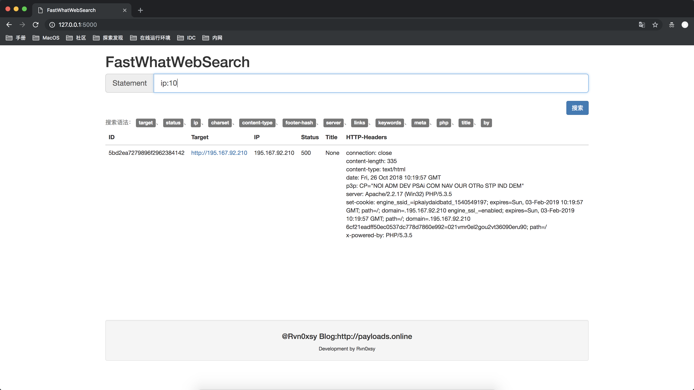

# FastWhatWebSearch



## 简介

FastWhatWebSearch 是一个能够支持搜索[whatweb](https://github.com/urbanadventurer/WhatWeb)工具结果的一个微型平台。

目前能够支持的语法如下：


|语法名|解释|
| --- | ---- |
| target | 目标 |
| status | 状态码 |
| ip | IP地址 |
| charset | 网页字符集 |
| content-type | 响应内容类型|
| footer-hash | 底部hash |
| server | 响应的server头|
| links | 网页上的超链接|
| keywords | 关键字 |
| meta | meta标签内容|
| php | php版本 |
| title | 网页标题 |
| by | x-powered-by|

## 安装方式

* 1.必要条件

首先你的系统上需要安装whatweb与mongodb

* 2.下载项目

```commandline
git clone http://github/Rvn0xsy/FastWhatWebSearch.git
cd FastWhatWebSearch
pip install -r ./requirements.txt
```

### 使用方式

1.首先要使用whatweb爬取目标，它将会自动写入数据到mongodb：

```commandline
./whatweb 0.0.0.0/24 --log-mongo-database=whatweb -p + ./plugins/title.rb
```

可以使用 `-p +`参数调用多个插件。

2.启动FastWhatWebSearch

```commandline
python app.py
```

3.访问：http://127.0.0.1:5000/

